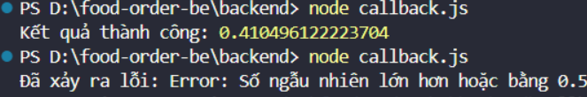
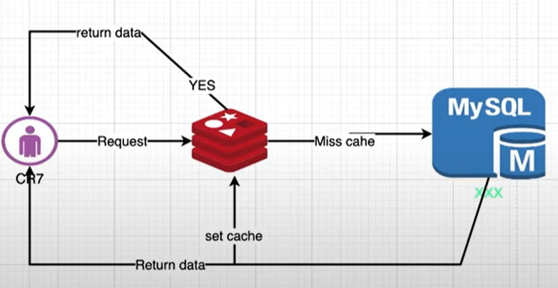

# Mục lục

1. [Mô hình MVC](#1-mô-hình-mvc)
   - [Định nghĩa](#a-định-nghĩa)
   - [Các thành phần trong mô hình MVC](#b-các-thành-phần-trong-mô-hình-mvc)
   - [Luồng xử lý](#c-luồng-xử-lý)
2. [Chuẩn hóa dữ liệu](#2-chuẩn-hóa-dữ-liệu)
   - [1NF](#a-1nf)
   - [2NF](#b-2nf)
   - [3NF](#c-3nf)
3. [API Define List API needs](#3-api-define-list-api-needs)
4. [Setup Postgres](#4-setup-postgres)
5. [Commit](#5-commit)
6. [Node.js](#6-nodejs)

# 1. Mô hình MVC:
## a. Định nghĩa:
- **Models(dữ liệu):**
Quản lí xử lí các dữ liệu.
- **Views(giao diện):**
Nơi hiển thị dữ liệu cho người dùng.
- **Controllers:**
Điều khiển sự tương tác giữa **views** và **models**

## b. Các thành phần trong mô hình MVC:
- **Models(dữ liệu):**
Là bộ phận có chức năng **lưu trữ toàn bộ dữ liệu** của ứng dụng và là cầu nối giữa 2 thành phần bên dưới là **View** và **Controller**. Một model là dữ liệu được sử dụng bởi chương trình. 
- **Views(giao diện):**
Đây là phần giao diện (theme) dành cho người sử dụng. **View** là phương tiện hiển thị các đối tượng trong một ứng dụng. Chẳng hạn như hiển thị một cửa sổ, nút hay văn bản trong một cửa sổ khác. Nó bao gồm bất cứ thứ gì mà người dùng có thể nhìn thấy được.
- **Controllers:**
Là bộ phận có nhiệm vụ xử lý các yêu cầu người dùng đưa đến thông qua **View**. Một controller bao gồm cả **Model** lẫn **View**. Nó nhận input và thực hiện các update tương ứng.

## c. Luồng xử lý:
- Khi có một yêu cầu gửi từ **Client** đến **Server** thì sẽ bị **Controller** chặn lại để xem đó là URL request hay sự kiện.
- Tiếp đến **COntroller** xử lý **input** của **User** rồi giao cho **Model**.
- Sau đó **Model** sẽ chuẩn bị data và gửi lại cho **Controller**
- Cuối cùng, khi xử lý xong yêu cầu của **User** thì **Controller** sẽ gửi dữ liệu trở lại **View** và hiển thị cho người dùng trên trình duyệt.

# 2. Chuẩn hóa dữ liệu:
# a. 1NF:
Yêu cầu mỗi thuộc tính trong bảng phải chứa một giá trị duy nhất và không được lặp lại.
- Trước khi được chuẩn hóa 1NF:

- Sau khi được chuẩn hóa 1NF:

# b. 2NF:
Đạt được 1NF và các thuộc tính phụ thuộc hoàn toàn vào khóa chính.
- **Ví dụ:**
Trong bảng **Employee**, các cột **Name**, **Dept_name**, **Salary** phụ thuộc vào cột **EmployeeID**. 
Trong bảng **Emp_Crs**, các cột **EmployeeID**, **CourseID** và **DateCompleted**  phụ thuộc vào cột **ID**. 
Trong bảng **Course**, cột **Course_Title** phụ thuộc vào cột **Course_ID**.

# c. 3NF:
Đạt được 2NF và các thuộc tính phải phụ thuộc trực tiếp vào khóa chính, không được bắc cầu qua một thuộc tính khác.
- **Ví dụ:**
Bảng thông tin đơn hàng ở dưới chưa được chuẩn hóa **3NF**, ta thấy có cột **OrderID** là **PK** nhưng các cột **CustomerName**, **CustomerCountry** vẫn phụ thuộc vào cột **FK** là **CustomerID**. 

Để chuẩn hóa **3NF** ta tách bảng ra như sau:


# 3. API Define List API needs:
- **GET:** Dùng để lấy dữ liệu từ máy chủ.
- **POST:** Dùng để đẩy dữ liệu lên máy chủ.
- **PUT:** Dùng để cập nhật dữ liệu hiện có trên máy chủ, nếu không thì nó sẽ tạo mới.
- **PATCH:** giống PUT nhưng chỉ dùng để cập nhật một phần dữ liệu trên máy chủ.
- **DELETE:** Dùng để xóa dữ liệu trên máy chủ.
# 4. Setup Postgres:
- Install Postgres
- Install library "pg" for Postgres
-  Set up the configuration for connecting to a PostgreSQL database from Node.js.
```javascript
module.exports = {
    HOST: "localhost",
    USER: "postgres",
    PASSWORD: "nguyenbalong",
    DB: "food_app",
    dialect: "postgres",
    pool: {
      max: 5,
      min: 0,
      acquire: 30000,
      idle: 10000
    }
};
```
- Use the configuration settings to connect to PostgreSQL using libraries like Sequelize.
    ```javascript
    const Sequelize = require("sequelize");
    db.Sequelize = Sequelize;
    db.sequelize = sequelize;
    ```
**Connection pool là gì, tại sao lại cần?**
Connection pool db là tạo ra nhiều các connection để chờ request tới database và nhiều request tới sẽ được chia connection để sử dụng. Nếu không có thì nhiều request đến database sẽ bị chờ lần lượt, vì vậy việc tạo ra connection pool là cần thiết để tối ưu hiệu suất và thời gian.
# 5. Commit
```bash
git add .
git commit -m "[HÀNH ĐỘNG CHUNG] - [NỘI DUNG CHI TIẾT] - [LƯU Ý NẾU CÓ]"
git push
```
# 6. Nodejs:
## a. Node.js hoạt động như thế nào?
**Node.js** là một đơn luồng. Server sẽ bao gồm một luồng duy nhất xử lý từ sự kiện này đến sự kiện khác.
Cách hoạt động của **Node.js**:
- **Client** gửi yêu cầu đến **Server** và lưu trong **Event Queue**
- **Event Loop** thường là file **server.js** để kiểm tra xem có yêu cầu nào trong **Event Queue** không. Nếu có thì lấy ra và thực thi.
- Nếu đó **không phải** là blocking IO thì tiếp tục xử lý và trả về **Client**
- Còn nếu đó là blocking IO (**ví dụ:** ghi vào cơ sở dữ liệu, đọc từ hệ thống tệp), Node.js sẽ k chờ mà giao cho **Thread Pool** để thực hiện nhằm tránh việc chặn luồng.
- Sau đó gửi kết quả lại cho **Client**
## b. Quản lý package trong ứng dụng Node.js?
Dùng npm để quản lý các package vì có nhiều điểm lợi:
- Cài đặt các gói dễ dàng
```bash
npm install <tên_gói>
```
- Quản lý phiên bản 
```bash
npm --version
```
- Xóa các gói không cần thiết
```bash
npm uninstall <tên_gói>
```
- Tìm kiếm gói
```bash
npm search <tên_gói>
```
## c. Ưu điểm của promise so với callback?
Quyết định hành động sau khi tác vụ hoàn thành: **Promise** cho phép bạn định nghĩa các hành động cần thực hiện sau khi một tác vụ bất đồng bộ hoàn thành. Bằng cách sử dụng phương thức **.then()**, bạn có thể xác định các đoạn mã để xử lý kết quả thành công của tác vụ.
## d. Tại sao Node.js là đơn luồng?
Tại vì nó được tạo ra như vậy trên lý thuyết đơn luồng có thể xử lý bất đồng bộ hiệu quả hơn so với các triển khai đa luồng truyền thống.
## e. Các kiểu hàm API trong node.js?
Có 2 kiểu hàm:
- **Hàm đồng bộ:** Xử lý theo thứ tự, phải chờ nếu tác vụ thực hiện lâu.
```javascript
const fs = require('fs');
const data = fs.readFileSync('/file.md'); // blocks here until file is read
console.log(data);
// moreWork(); will run after console.log
```
Phải chờ để đọc **file.md** và **moreWork()** sẽ chạy sau **console.log**
- **Hàm bất đồng bộ:** Không chờ mà thực hiện tác vụ khác.
```javascript
const fs = require('fs');
fs.readFile('/file.md', (err, data) => {
  if (err) throw err;
  console.log(data);
});
// moreWork(); will run before console.log
```
Không chờ đọc **file.md** thay vào đó chạy tiếp **moreWork()**, đọc xong thì sẽ in **console.log**
## f. Node.js Async
- **Callback:** **Callback** là một hàm **A** được truyền vào một hàm **B** như một đối số và hàm **A** sẽ được hàm **B** gọi lại sau một thời gian nhất định.
**Ví dụ:**


Hàm **readFile** không chặn luồng chạy mà in ra được ‘Chương trình kết thúc’ sau đó mới quay lại đọc **input.txt**.
- **Callback Hell:** Khi sử dụng nhiều **Callback** lồng nhau => khó đọc, khó bảo trì.
**Ví dụ:**

- **Promise:** Sử dụng **promise** sẽ khắc phục được việc **callback hell**, bằng cách nó có 3 trạng thái **(Pending, Resolved, Rejected)** giúp nó trở nên rõ ràng hơn so với **callback**.

Hàm **asyncOperation** random ra 1 số sau đó nếu số đó < 0.5 thì sẽ được **resolve** và in ra ‘Kết quả thành công’ nếu số đó nhỏ hơn 0.5 thì sẽ bị **reject** và in ra ‘Đã xảy ra lỗi: Error: Số ngẫu nhiên lớn hơn hoặc bằng 0.5’

- **Async, await:** **async** được dùng để định nghĩa 1 **hàm bất đồng bộ**, **await** được dùng để đợi 1 **promise** được giải quyết.

Hàm **asyncOperation** trả về một **promise**.
Hàm **main** có **async** nên được dùng **await** để đợi kết quả của **asyncOperation** sau đó gán vào **result** và in ra tương tự.

## g. Sự khác biệt giữa bất đồng bộ và non-blocking?
|Bất đồng bộ|Non-blocking|
|-----------|------------|
|Không phản hồi ngay(nếu không có dữ liệu)|Luôn phản hồi kể cả không có dữ liệu thì trả về lỗi|
|Cải thiện hiệu quả vì tác vụ có thể đến sau, trong lúc chờ thì thực hiện các tác vụ khác|Không chặn bất kì quá trình thực thi nào nếu dữ liệu có sẵn, thực hiện nhanh chóng|
|trái với đồng bộ|trái với blocking I/O|
## h. Ý nghĩa của module.exports?
Được sử dụng để hiển thị các chức năng của một **module** hoặc **file** cụ thể để sử dụng ở những nơi khác trong dự án. Nó có thể đóng gói tất cả các chức năng tương tự để cải thiện cấu trúc dự án.
## i. Event loop
Trong Node.js, event loop là một phần quan trọng của kiến trúc **non-blocking Input/Output**, giúp cho ứng dụng có thể xử lý nhiều thứ cùng một lúc mà không bị chặn bởi các hoạt động đồng bộ.
Event loop là một vòng lặp vô hạn mà Node.js sử dụng để lắng nghe và xử lý các sự kiện. Các sự kiện có thể là I/O hoặc các hành động được lên lịch trình bởi mã JavaScript (như callbacks hoặc Promises).
- **Lắng nghe và đợi các sự kiện:** Event loop bắt đầu bằng việc lắng nghe các sự kiện từ hàng đợi sự kiện.
- **Xử lý các sự kiện:** Khi một sự kiện xảy ra (ví dụ: kết thúc một tác vụ I/O hoặc hết thời gian chờ của một hẹn giờ), event loop sẽ gọi các callback hoặc sự kiện tương ứng để xử lý sự kiện đó.
- **Thực hiện các tác vụ đồng bộ:** Event loop sẽ thực hiện các tác vụ đồng bộ được lên lịch trình bởi mã JavaScript trong bối cảnh của các sự kiện đã xảy ra.
- **Chờ và lắng nghe sự kiện tiếp theo:** Sau khi xử lý xong một sự kiện, event loop sẽ tiếp tục lắng nghe và chờ đợi các sự kiện tiếp theo.
```javascript
// Ví dụ một tác vụ bất đồng bộ: setTimeout
console.log("Bắt đầu");

// Đặt một hẹn giờ cho 2 giây sau
setTimeout(function() {
    console.log("Tác vụ bất đồng bộ đã hoàn thành!");
}, 2000);

// Tiếp tục thực hiện các tác vụ khác
console.log("Thực hiện các tác vụ khác");

// Kết thúc chương trình
console.log("Kết thúc");
```
Trong ví dụ này, có một tác vụ bất đồng bộ là **setTimeout**, nơi chúng ta đặt một hẹn giờ để ghi ra một thông điệp sau 2 giây. Trong khi đợi 2 giây, Node.js không chờ đợi mà thay vào đó tiếp tục thực hiện các tác vụ khác. Kết quả là các thông điệp được ghi ra sẽ không phải đợi cho **setTimeout** hoàn thành trước khi xuất hiện trên màn hình.

## j. Node.js giải quyết vấn đề block I/O thế nào?
Khi một hoạt động I/O được gửi thì thay vì chờ đợi thì sẽ được đưa vào event loop, sau đó event loop tiếp tục thực hiện các yêu cầu khác trong khi chờ I/O thực hiện xong. Khi hoạt động I/O đã thực hiện xong thì một hàm callback sẽ được gọi để xử lý kết quả.
## k. Middleware là gì?
Middleware nằm giữa request và logic nghiệp vụ. Nó được dùng để ghi log, giới hạn truy cập, định tuyến, xác thực hay bất cứ điều gì không phải là một phần của logic nghiệp vụ.
- **Nhận yêu cầu từ client:** Nhận các yêu cầu như HTTP GET, POST, PUT, DELETE.
- **Xử lý yêu cầu:** phân tích URL có hợp lệ không, kiểm tra quyền truy cập.
- **Chuyển tiếp cho middleware phía sau:** thực hiện bằng cách gọi hàm next().
- **Xử lý logic của middleware**.
- **Xử lý phản hồi:** Phản hồi về client nếu lỗi.
## l. Authentication(Xác thực) và Authorization(Phân quyền)
- **Authentication:**
  - **Quá trình:** Xác thực thường bắt đầu khi cung cấp tên người dùng và mật khẩu.
  - **Xác thực:** Thông tin đăng nhập được gửi từ client đến server. Server sẽ kiểm tra thông tin này bằng cách so sánh với dữ liệu trong database.
  - **Kết quả:** Nếu thông tin đăng nhập hợp lệ, thì sẽ cấp cho một mã JWT.
- **Authorization:**
  - **Quá trình:** Sau khi xác thực xong thì người dùng yêu cầu truy cập vào tài nguyên nào đó.
  - **Xác thực:** Server sẽ kiểm tra xem người dùng đó có quyền truy cập vào không dựa trên quyền hạn được gắn cho họ.
  - **Kết quả:** Nếu người dùng có quyền thì sẽ được cung cấp tài nguyên đó và ngược lại sẽ trả lại lỗi phù hợp.
# 7. Redis:

- Người dùng sẽ gửi **request** tới cache:
  - Nếu có data trong cache thì sẽ trả lại người dùng ngay.
  - Nếu không có data trong cache thì sẽ tới db để lấy data rồi trả về cho người dùng và set cache.
# 8. SSR và CSR:
- **Server side** và **client side**:
  - **Server side** là phía ứng dụng của web mà mã được thực thi và xử lý trên **máy chủ**.
  - **Client side** là phía ứng dụng của web mà mã được thực thi và xử lý trên **trình duyệt của người dùng**.
- **Server side rendering** và **client side rendering**
  - **SSR**:
    - Là quá trình mà trang web được tạo ra mà render trên máy chủ trước khi được gửi đến trình duyệt của người dùng.
    - Hoạt động: Mỗi khi có yêu cầu từ client, máy chủ sẽ tạo ra trang HTML hoàn chỉnh và gửi nó cho client sau đó sẽ được hiển thị ngay khi tải lại trang.
  - **CSR**:
    - Là quá trình mà trang web được tạo ra và render trên trình duyệt của người dùng bằng Javascript sau khi khác tệp tĩnh đã được tải về.
    - Hoạt động: Trang web trả về một cấu trúc HTML cơ bản và Javascript tải dữ liệu và render giao diện người dùng dựa trên dữ liệu đó.