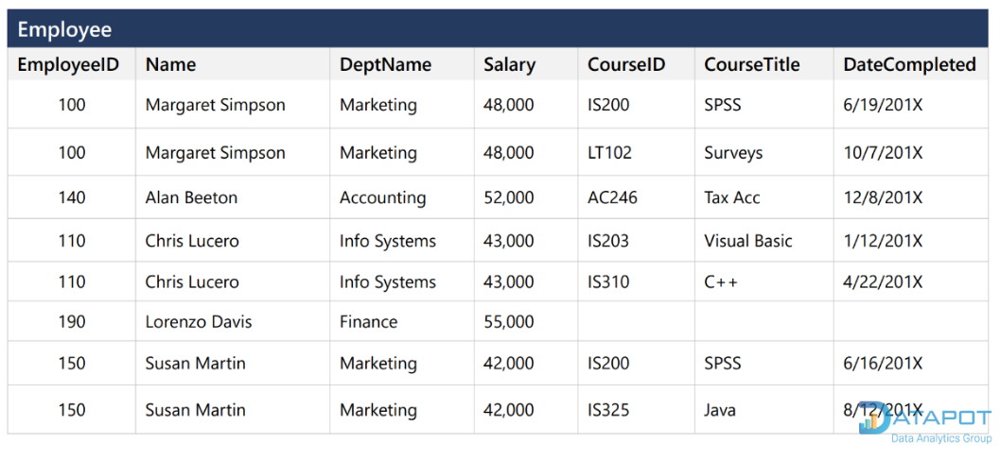
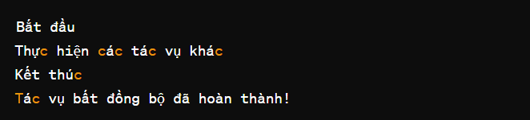

# Mục lục

1. [Mô hình MVC](#1-mô-hình-mvc)
   - [Định nghĩa](#a-định-nghĩa)
   - [Các thành phần trong mô hình MVC](#b-các-thành-phần-trong-mô-hình-mvc)
   - [Luồng xử lý](#c-luồng-xử-lý)
2. [Chuẩn hóa dữ liệu](#2-chuẩn-hóa-dữ-liệu)
   - [1NF](#a-1nf)
   - [2NF](#b-2nf)
   - [3NF](#c-3nf)
3. [API Define List API needs](#3-api-define-list-api-needs)
4. [Node.js Async](#4-nodejs-async)
   - [Callback](#a-callback)
   - [Callback Hell](#b-callback-hell)
   - [Promise](#c-promise)
   - [Async, await](#d-async-await)
5. [Setup Postgres](#5-setup-postgres)
6. [Event Loop](#6-event-loop)
7. [Commit](#7-commit)

# 1. Mô hình MVC:
## a. Định nghĩa:
- **Models(dữ liệu):**
Quản lí xử lí các dữ liệu.
- **Views(giao diện):**
Nơi hiển thị dữ liệu cho người dùng.
- **Controllers:**
Điều khiển sự tương tác giữa **views** và **models**

## b. Các thành phần trong mô hình MVC:
- **Models(dữ liệu):**
Là bộ phận có chức năng **lưu trữ toàn bộ dữ liệu** của ứng dụng và là cầu nối giữa 2 thành phần bên dưới là **View** và **Controller**. Một model là dữ liệu được sử dụng bởi chương trình. 
- **Views(giao diện):**
Đây là phần giao diện (theme) dành cho người sử dụng. **View** là phương tiện hiển thị các đối tượng trong một ứng dụng. Chẳng hạn như hiển thị một cửa sổ, nút hay văn bản trong một cửa sổ khác. Nó bao gồm bất cứ thứ gì mà người dùng có thể nhìn thấy được.
- **Controllers:**
Là bộ phận có nhiệm vụ xử lý các yêu cầu người dùng đưa đến thông qua **View**. Một controller bao gồm cả **Model** lẫn **View**. Nó nhận input và thực hiện các update tương ứng.

## c. Luồng xử lý:
- Khi có một yêu cầu gửi từ **Client** đến **Server** thì sẽ bị **Controller** chặn lại để xem đó là URL request hay sự kiện.
- Tiếp đến **COntroller** xử lý **input** của **User** rồi giao cho **Model**.
- Sau đó **Model** sẽ chuẩn bị data và gửi lại cho **Controller**
- Cuối cùng, khi xử lý xong yêu cầu của **User** thì **Controller** sẽ gửi dữ liệu trở lại **View** và hiển thị cho người dùng trên trình duyệt.

# 2. Chuẩn hóa dữ liệu:
# a. 1NF:
Yêu cầu mỗi thuộc tính trong bảng phải chứa một giá trị duy nhất và không được lặp lại.
- Trước khi được chuẩn hóa 1NF:

- Sau khi được chuẩn hóa 1NF:

# b. 2NF:
Đạt được 1NF và các thuộc tính phụ thuộc hoàn toàn vào khóa chính.
- **Ví dụ:**
Trong bảng **Employee**, các cột **Name**, **Dept_name**, **Salary** phụ thuộc vào cột **EmployeeID**. 
Trong bảng **Emp_Crs**, các cột **EmployeeID**, **CourseID** và **DateCompleted**  phụ thuộc vào cột **ID**. 
Trong bảng **Course**, cột **Course_Title** phụ thuộc vào cột **Course_ID**.

# c. 3NF:
Đạt được 2NF và các thuộc tính phải phụ thuộc trực tiếp vào khóa chính, không được bắc cầu qua một thuộc tính khác.
- **Ví dụ:**
Bảng thông tin đơn hàng ở dưới chưa được chuẩn hóa **3NF**, ta thấy có cột **OrderID** là **PK** nhưng các cột **CustomerName**, **CustomerCountry** vẫn phụ thuộc vào cột **FK** là **CustomerID**. 

Để chuẩn hóa **3NF** ta tách bảng ra như sau:


# 3. API Define List API needs:
- **GET:** Dùng để lấy dữ liệu từ máy chủ.
- **POST:** Dùng để đẩy dữ liệu lên máy chủ.
- **PUT:** Dùng để cập nhật dữ liệu hiện có trên máy chủ, nếu không thì nó sẽ tạo mới.
- **PATCH:** giống PUT nhưng chỉ dùng để cập nhật một phần dữ liệu trên máy chủ.
- **DELETE:** Dùng để xóa dữ liệu trên máy chủ.
# 4. Nodejs Async:
- **Callback:** **Callback** là một hàm **A** được truyền vào một hàm **B** như một đối số và hàm **A** sẽ được hàm **B** gọi lại sau một thời gian nhất định.
**Ví dụ:**


Hàm **readFile** không chặn luồng chạy mà in ra được ‘Chương trình kết thúc’ sau đó mới quay lại đọc **input.txt**.
- **Callback Hell:** Khi sử dụng nhiều **Callback** lồng nhau => khó đọc, khó bảo trì.
**Ví dụ:**

- **Promise:** Sử dụng **promise** sẽ khắc phục được việc **callback hell**, bằng cách nó có 3 trạng thái **(Pending, Resolved, Rejected)** giúp nó trở nên rõ ràng hơn so với **callback**.

Hàm **asyncOperation** random ra 1 số sau đó nếu số đó < 0.5 thì sẽ được **resolve** và in ra ‘Kết quả thành công’ nếu số đó nhỏ hơn 0.5 thì sẽ bị **reject** và in ra ‘Đã xảy ra lỗi: Error: Số ngẫu nhiên lớn hơn hoặc bằng 0.5’

- **Async, await:** **async** được dùng để định nghĩa 1 **hàm bất đồng bộ**, **await** được dùng để đợi 1 **promise** được giải quyết.

Hàm **asyncOperation** trả về một **promise**.
Hàm **main** có **async** nên được dùng **await** để đợi kết quả của **asyncOperation** sau đó gán vào **result** và in ra tương tự.

# 5. Setup Postgres:
- Install Postgres
- Install library "pg" for Postgres
-  Set up the configuration for connecting to a PostgreSQL database from Node.js.
```javascript
module.exports = {
    HOST: "localhost",
    USER: "postgres",
    PASSWORD: "nguyenbalong",
    DB: "food_app",
    dialect: "postgres",
    pool: {
      max: 5,
      min: 0,
      acquire: 30000,
      idle: 10000
    }
};
```
- Use the configuration settings to connect to PostgreSQL using libraries like Sequelize.
    ```javascript
    const Sequelize = require("sequelize");
    db.Sequelize = Sequelize;
    db.sequelize = sequelize;
    ```
**Connection pool là gì, tại sao lại cần?**
Connection pool db là tạo ra nhiều các connection để chờ request tới database và nhiều request tới sẽ được chia connection để sử dụng. Nếu không có thì nhiều request đến database sẽ bị chờ lần lượt, vì vậy việc tạo ra connection pool là cần thiết để tối ưu hiệu suất và thời gian.
# 6. Event Loop:
Trong Node.js, event loop là một phần quan trọng của kiến trúc **non-blocking Input/Output**, giúp cho ứng dụng có thể xử lý nhiều thứ cùng một lúc mà không bị chặn bởi các hoạt động đồng bộ.
Event loop là một vòng lặp vô hạn mà Node.js sử dụng để lắng nghe và xử lý các sự kiện. Các sự kiện có thể là I/O hoặc các hành động được lên lịch trình bởi mã JavaScript (như callbacks hoặc Promises).
- **Lắng nghe và đợi các sự kiện:** Event loop bắt đầu bằng việc lắng nghe các sự kiện từ hàng đợi sự kiện.
- **Xử lý các sự kiện:** Khi một sự kiện xảy ra (ví dụ: kết thúc một tác vụ I/O hoặc hết thời gian chờ của một hẹn giờ), event loop sẽ gọi các callback hoặc sự kiện tương ứng để xử lý sự kiện đó.
- **Thực hiện các tác vụ đồng bộ:** Event loop sẽ thực hiện các tác vụ đồng bộ được lên lịch trình bởi mã JavaScript trong bối cảnh của các sự kiện đã xảy ra.
- **Chờ và lắng nghe sự kiện tiếp theo:** Sau khi xử lý xong một sự kiện, event loop sẽ tiếp tục lắng nghe và chờ đợi các sự kiện tiếp theo.
```javascript
// Ví dụ một tác vụ bất đồng bộ: setTimeout
console.log("Bắt đầu");

// Đặt một hẹn giờ cho 2 giây sau
setTimeout(function() {
    console.log("Tác vụ bất đồng bộ đã hoàn thành!");
}, 2000);

// Tiếp tục thực hiện các tác vụ khác
console.log("Thực hiện các tác vụ khác");

// Kết thúc chương trình
console.log("Kết thúc");
```
Trong ví dụ này, có một tác vụ bất đồng bộ là **setTimeout**, nơi chúng ta đặt một hẹn giờ để ghi ra một thông điệp sau 2 giây. Trong khi đợi 2 giây, Node.js không chờ đợi mà thay vào đó tiếp tục thực hiện các tác vụ khác. Kết quả là các thông điệp được ghi ra sẽ không phải đợi cho **setTimeout** hoàn thành trước khi xuất hiện trên màn hình.

# 7. Commit
```bash
git add .
git commit -m "[HÀNH ĐỘNG CHUNG] - [NỘI DUNG CHI TIẾT] - [LƯU Ý NẾU CÓ]"
git push
```
