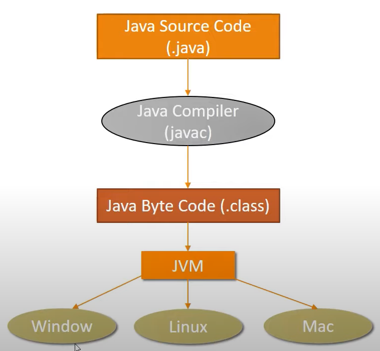
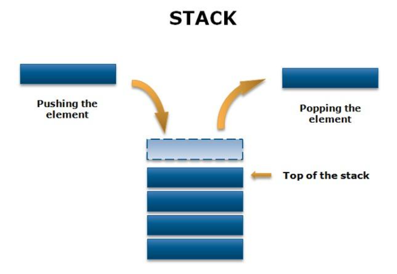
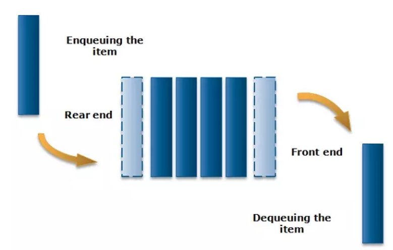
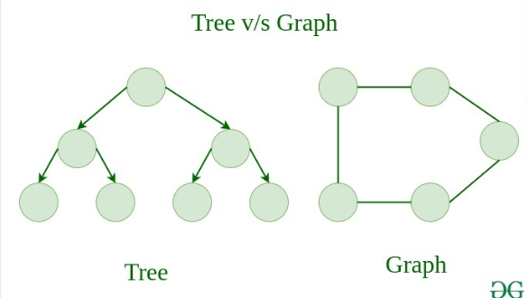
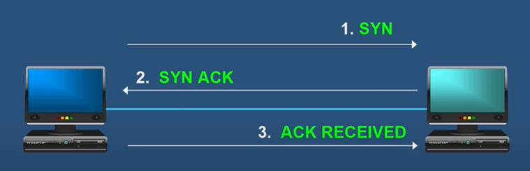

# I. Java:
## 1. Biến và kiểu dữ liệu:
### a. Biến:
```java
public class Bien {
    public static float PI = 3.14f;  //Đây là biến static
    int n;                           //Đây là biến instance
    
    public Bien () {
        char c = 'c';                //Đây là biến local
    }
} 
```
- **Biến local**:
**Định nghĩa:** là biến được khai báo bên trong một phương thức, khối lệnh hoặc cấu trúc lệnh.
**Phạm vi:** chỉ được truy cập từ bên trong phương thức hoặc khối lệnh nơi nó được khai báo. Khi phương thức hoặc khối lệnh đó kết thúc, biến local sẽ bị hủy.
**Khởi tạo:** phải được khởi tạo trước khi sử dụng. 
- **Biến Instance**:
**Định nghĩa:** là biến được khai báo bên trong một lớp, nhưng bên ngoài bất kỳ phương thức, khối lệnh hoặc cấu trúc lệnh nào. 
**Phạm vi:** có phạm vi từ khi đối tượng được tạo ra cho đến khi đối tượng bị thu gom rác (garbage collected). Biến instance có thể được truy cập bởi tất cả các phương thức của lớp đó.
**Khởi tạo:** có thể được khởi tạo trực tiếp khi khai báo hoặc thông qua các khối khởi tạo, hàm khởi tạo. Nếu không được khởi tạo, biến instance sẽ được khởi tạo với giá trị mặc định (ví dụ: 0 cho số nguyên, null cho đối tượng, false cho boolean).
- **Biến Static**:
**Định nghĩa:** là biến được khai báo với từ khóa static bên trong một lớp. Biến này không thuộc về bất kỳ đối tượng cụ thể nào mà thuộc về chính lớp đó.
**Phạm vi:** có phạm vi toàn cục trong lớp và có thể được truy cập bởi tất cả các đối tượng của lớp đó. Nó cũng có thể được truy cập mà không cần tạo một đối tượng của lớp.
**Khởi tạo:** có thể được khởi tạo khi khai báo hoặc trong khối khởi tạo static. Nếu không được khởi tạo, nó sẽ nhận giá trị mặc định tương tự như biến instance.
### b. Kiểu dữ liệu:
kiểu dữ liệu|Mô tả
------------|-----
byte        | Dùng để lưu dữ liệu kiểu số nguyên có kích thước một byte (8 bít). Phạm vi biểu diễn giá trị từ -128 đến 127. Giá trị mặc định là 0.
char        | Dùng để lưu dữ liệu kiểu kí tự hoặc số nguyên không âm có kích thước 2 byte (16 bít). Phạm vi biểu diễn giá trị từ 0 đến u\ffff. Giá trị mặc định là 0.
boolean     | Dùng để lưu dữ liệu chỉ có hai trạng thái đúng hoặc sai (độ lớn chỉ có 1 bít). Phạm vi biểu diễn giá trị là {“True”, “False”}. Giá trị mặc định là False.
short       | Dùng để lưu dữ liệu có kiểu số nguyên, kích cỡ 2 byte (16 bít). Phạm vi biểu diễn giá trị từ - 32768 đến 32767. Giá trị mặc định là 0.
int         | Dùng để lưu dữ liệu có kiểu số nguyên, kích cỡ 4 byte (32 bít). Phạm vi biểu diễn giá trị từ -2,147,483,648 đến 2,147,483,647. Giá trị mặc định là 0.
long        | Dùng để lưu dữ liệu có kiểu số nguyên có kích thước lên đến 8 byte. Giá trị mặc định là 0L.
float       | Dùng để lưu dữ liệu có kiểu số thực, kích cỡ 4 byte (32 bít). Giá trị mặc định là 0.0F.
double      | Dùng để lưu dữ liệu có kiểu số thực có kích thước lên đến 8 byte. Giá trị mặc định là 0.00D.
## 2. Các toán tử:

**Toán tử số học:**
Toán tử|Mô tả|
-------|-----|
\+ |Trả về giá trị là tổng của hai toán hạng	
\- |Trả về kết quả là hiệu của hai toán hạng.	
\* |Trả về giá trị là tích của hai toán hạng.	
/ |Trả về giá trị là thương của phép chia.	
%      |Giá trị trả về là phần dư của phép chia	
++     |Tăng giá trị của biến lên 1. Ví dụ a++ tương đương với a = a + 1	
--     |Giảm giá trị của biến 1 đơn vị. Ví dụ a-- tương đương với a = a - 1	
+=     |Cộng các giá trị của toán hạng bên trái vào toán hạng bên phải và gán giá trị trả về vào toán hạng bên trái. Ví dụ c += a tương đương c = c + a
-=     |Trừ các giá trị của toán hạng bên trái vào toán toán hạng bên phải và gán giá trị trả về vào toán hạng bên trái. Ví dụ c -= a tương đương với c = c - a
*=     |Nhân các giá trị của toán hạng bên trái với toán toán hạng bên phải và gán giá trị trả về vào toán hạng bên trái. Ví dụ c *= a tương đương với c = c * a
/=     |Chia giá trị của toán hạng bên trái cho toán toán hạng bên phải và gán giá trị trả về vào toán hạng bên trái. Ví dụ c /= a tương đương với c = c/a
%=     |Chia giá trị của toán hạng bên trái cho toán toán hạng bên phải và gán giá trị số dư vào toán hạng bên trái. Ví dụ c %= a tương đương với c = c%a

**Các toán tử quan hệ:**
Toán tử|Mô tả
-------|-----
 ==|Toán tử này kiểm tra sự tương đương của hai toán hạng
 !=|Toán tử này kiểm tra sự khác nhau của hai toán hạng
 \> |Kiểm tra giá trị của toán hạng bên phải lớn hơn toán hạng bên trái hay không
 < |Kiểm tra giá trị của toán hạng bên phải có nhỏ hơn toán hạng bên trái hay không
 \>=|Kiểm tra giá trị của toán hạng bên phải có lớn hơn hoặc bằng toán hạng bên trái hay không
 <=|Kiểm tra giá trị của toán hạng bên phải có nhỏ hơn hoặc bằng toán hạng bên trái hay không

Các toán tử logic:
Toán tử|Mô tả
-------|-----
&&     |Trả về một giá trị “Đúng” (True) nếu chỉ khi cả hai toán tử có giá trị “True”
\|\|   |Trả về giá trị “True” nếu ít nhất một giá trị là True
^      |Trả về giá trị True nếu và chỉ nếu chỉ một trong các giá trị là True, các trường hợp còn lại cho giá trị False (sai)
!      |Toán hạng đơn tử NOT. Chuyển giá trị từ True sang False và ngược lại.

**Toán tử điều kiện:**

```java
<biểu thức 1> ? <biểu thức 2> : <biểu thức 3>;
```

biểu thức 1: biểu thức logic. Trả về giá trị True hoặc False.
biểu thức 2: là giá trị trả về nếu biểu thức 1 là True.
biểu thức 3: là giá trị trả về nếu biểu thức 1 là False.
## 3. Các câu lệnh điều kiện:
### a. Mệnh đề if else:
```java
if (condition) {
    // khối lệnh này được thực thi
    // nếu condition = true
} else {
    // khối lệnh này được thực thi
    // nếu condition = false
}  
```
### b. Mệnh đề switch case:
```java
switch (bieu_thuc) {    
case gia_tri_1:
    // Khối lệnh 1
    break;  //tùy chọn
case gia_tri_2:    
    // Khối lệnh 2
    break;  //tùy chọn
......    
case gia_tri_n:    
    // Khối lệnh n
    break;  //tùy chọn    
default:     
    // Khối lệnh này được thực thi 
    // nếu tất cả các điều kiện trên không thỏa mãn 
}   
```

## 4. Vòng lặp:
### a. Vòng lặp For:
```java
for (khoi_tao_bien ; check_dieu_kien ; tang/giam_bien) {  
    // Khối lệnh được thực thi
} 
```
Ví dụ:
```java
for(int i = 0; i < 10; i++){
    System.out.println(i);
}
```
Kết quả sẽ in ra 10 là i từ 0 tới 9.

Vòng lặp for cải tiến:
```java
for (Type var : array) {  
    // Khối lệnh được thực thi
} 
```
Ví dụ:
```java
int arr[] = { 12, 23, 44, 56, 78 };
        for (int i : arr) {
            System.out.println(i);
        }
```
Kết quả:
```
12
23
44
56
78
```
### b. Vòng lặp While:
```java
while(condition) {  
    // Khối lệnh được lặp lại cho đến khi condition = False
}
```
Ví dụ:
```java
  int i = 1;
  while (i <= 10) {
   System.out.println(i);
   i++;
  }
```
Kết quả:
```
1
2
3
4
5
6
7
8
9
10
```
### c. Vòng lặp Do-While:
```java
do {  
    // Khối lệnh được thực thi
} while(condition); 
```
Ví dụ:
```java
int a = 1, sum = 0;
        do {
            sum += a;
            a++;
        } while (a <= 5);
        System.out.println("Sum of 1 to 5  is " + sum);
```
Biến a được khởi tạo với giá trị 1, sau đó nó vừa được dùng làm biến chạy (tăng lên 1 sau mỗi lần lặp) vừa được dùng để cộng dồn vào biến sum. Tại thời điểm kết thúc, chương trình sẽ in ra Sum of 1 to 5 is 15.
Kết quả:
```
Sum of 1 to 5 is 15
```

## 5. Mảng:
### a. Mảng 1 chiều trong java:
```java
int[] arr = new int[10]
```
Đây là cách khai báo mảng số nguyên 1 chiều gồm 10 phần tử trong mảng.
### b. Mảng 2 chiều trong java:
```java
int[][] arr = new int[10][9]
```
Đây là cách khai báo mảng 2 chiều gồm 10 hàng và 9 cột.
```java
for (int i = 0; i < arr.length; i++) {
    for (int j = 0; j < arr[i].length; j++) {
                arr[i][j] = i * j; // Ví dụ gán giá trị bằng tích của chỉ số hàng và cột
    }
}
for (int i = 0; i < arr.length; i++) {
    for (int j = 0; j < arr[i].length; j++) {
                System.out.print(arr[i][j] + " ");
    }
    System.out.println(); // Xuống dòng sau mỗi hàng
}
```
Kết quả sẽ là:
```
0 0 0 0 0 0 0 0 0 
0 1 2 3 4 5 6 7 8 
0 2 4 6 8 10 12 14 16 
0 3 6 9 12 15 18 21 24 
0 4 8 12 16 20 24 28 32 
0 5 10 15 20 25 30 35 40 
0 6 12 18 24 30 36 42 48 
0 7 14 21 28 35 42 49 56 
0 8 16 24 32 40 48 56 64 
0 9 18 27 36 45 54 63 72 
```
## 6. Compile và Runtime Time:
### a. Compile Time:
- Là giai đoạn chuyển source code java về bytecode từ .java về .class.
- Trong giai đoạn này, trình biên dịch kiểm tra cú pháp và cấu trúc của mã nguồn, đồng thời kiểm tra các lỗi cú pháp và lỗi logic cơ bản.
- Nếu có bất kỳ lỗi nào được phát hiện trong quá trình biên dịch, trình biên dịch sẽ thông báo lỗi và dừng quá trình biên dịch.
### b. Runtime Time:
- Là giai đoạn chạy chương trình từ bytecode .class sau khi đã compile trên môi trường máy ảo JVM.
Trong quá trình thực thi, nếu có lỗi xảy ra như chia cho 0, truy cập vào phần tử mảng không hợp lệ, hoặc bất kỳ lỗi nào không thể được phát hiện trong quá trình biên dịch, thì JVM sẽ thông báo lỗi runtime và chương trình sẽ dừng hoạt động.

## 7. Các khái niệm của Java OOPs:
### a. Class:
Một lớp là một khuôn mẫu (template) hoặc bản thiết kế (blueprint) cho các đối tượng (object). Nó định nghĩa các thuộc tính (attributes) và phương thức (methods) mà các đối tượng của lớp đó sẽ có.
```java
public class Car {
    // Thuộc tính
    private String color;
    private String model;

    // Constructor
    public Car(String color, String model) {
        this.color = color;
        this.model = model;
    }

    // Phương thức
    public void display() {
        System.out.println("Car model: " + model + ", Color: " + color);
    }
}

```
### b. Object:
Một đối tượng là một thể hiện (instance) cụ thể của một lớp. Nó được tạo ra từ lớp và có các giá trị cụ thể cho các thuộc tính của lớp.
```java
        // Tạo đối tượng từ lớp Car
        Car myCar = new Car("Red", "Toyota");

        // Gọi phương thức trên đối tượng
        myCar.display();
```
### c. Constructor và Method:
**Method** là một hàm được định nghĩa bên trong một lớp và hoạt động trên các đối tượng của lớp đó.
**Constructor** trong java là một dạng đặc biệt của phương thức được sử dụng để khởi tạo các đối tượng.
**Constructor** được gọi tại thời điểm tạo đối tượng. Nó khởi tạo các giá trị để cung cấp dữ liệu cho các đối tượng, đó là lý do tại sao nó được gọi là constructor.
Khai báo của **Constructor** giống với khải báo của **method** (phương thức). Nó phải có cùng tên với class (lớp) và không có giá trị trả về.

Có 2 kiểu của **constructor**:

Constructor mặc định (không có tham số truyền vào – default constructors).
Constructor tham số (parameterized constructors).
Ví dụ:
```java
    // Default constructor
    public Car() {
    }
    // Parameterized constructor
    public Car(String color, String model) {
        this.color = color;
        this.model = model;
    }
```
### d. Phạm vi truy cập:
Access Modifier|Bên trong class|Bên trong Package|Bên ngoài package bởi class con|Bên ngoài class và không thuộc class con
----------|----------|-----------|-----------|---------
private|Y|N|N|N
Default|Y|Y|N|N
protected|Y|Y|Y|N
public|Y|Y|Y|Y

## 8. Các tính chất của Java OOPs:
### a. Tính đóng gói (Encapsulation)
Nhờ Access Modifier mà có thể bảo vệ được các thuộc tính, phương thức ở trong class đó.
Ví dụ:
```java
public class Car {
    // Thuộc tính
    private String color;
    private String model;
}
```
Đây là trong class Car và thuộc tính color và model được khai báo là private nên chỉ có thể được dùng ở trong lớp này.
### b. Tính kế thừa (Inheritance)
Một class sẽ được kế thừa tất cả thuộc tính, phương thức của class kế thừa.
Ví dụ:
```java
public class Driver{
    private String comment;
    
    public void display(){
        System.out.print("abc");
    }
}
```
Và class Car sẽ kế thừa class Driver như sau:
```java
public class Car extends Driver {
    // Thuộc tính
    private String color;
    private String model;
}
```

### c. Tính đa hình (Polymorphism)
Đa hình là khả năng của một đối tượng để biểu diễn dưới nhiều hình thái khác nhau.
Tính đa hình có thể đạt được bằng 2 cách là:
- Nạp chồng phương thức(method overloading)
```java
public class Calculator {
    // Phương thức nạp chồng với 2 tham số kiểu int
    public int add(int a, int b) {
        return a + b;
    }

    // Phương thức nạp chồng với 3 tham số kiểu int
    public int add(int a, int b, int c) {
        return a + b + c;
    }

    // Phương thức nạp chồng với 2 tham số kiểu double
    public double add(double a, double b) {
        return a + b;
    }
}
```
như vậy phương thức **add** có thể thực hiện bởi số nguyên và số thực mà không cần tạo ra nhiều tên gọi khác cho phương thức add như addInt, addDouble
- Ghi đè phương thức(method overriding)
```java
public class Animal {
    public void makeSound() {
        System.out.println("Animal makes a sound");
    }
}

public class Dog extends Animal {
    // Ghi đè phương thức makeSound trong lớp cha Animal
    @Override
    public void makeSound() {
        System.out.println("Dog barks");
    }
}
```
Khi class Dog kế thừa class Animal thì sẽ sở hữu phương thức **makeSound** và khi dùng thì sẽ in ra "Animal makes a sound" nhưng có thể ghi đè bằng cách khai báo lại phương thức **makeSound** ở trong class Dog và hiển thị ra "Dog barks"
### d. Tính trừu tượng (Abstraction)
Trừu tượng (Abstraction) là quá trình tạo ra một mô hình giản lược của một đối tượng trong thế giới thực.
Trừu tượng giúp ẩn đi chi tiết bên trong của một đối tượng và chỉ hiển thị các thông tin cần thiết cho việc sử dụng bên ngoài.
Ví dụ:
Khai báo class Animal:
```java
public interface Animal{
    void makeSound();
}
```
Các class nào muốn kế thừa interface Animal thì phải thực hiện các phương thức bên trong Animal
```java
public class Dog implements Animal {
    System.out.println("Dog barks");
}
```
## 9. Cấu trúc dữ liệu và thuật toán:
### a. Cấu trúc dữ liệu:
**Array** và **Linked List**
- Array khi khai báo phải cố định số lượng phần tử vì vậy khi khai báo một array gồm 5 phần tử thì việc thêm phần tử thứ 6 thì phải tạo một array khác gồm 6 phần tử và copy 5 phần tử có sẵn, tương tự như việc xóa một phần tử ở giữa mảng thì phải dịch các phần tử phía sau lại trước => độ phức tạp O(n).
- Linked List gồm những node có đường dẫn liên kết với nhau giúp việc thêm phần tử và xóa phần tử trở nên đơn giản hơn với độ phức tạp O(1). Tuy nhiên việc tìm kiếm phần tử trở nên khó khăn hơn vì không có index cụ thể cho từng phần tử => độ phức tạp O(n).
**Stack** và **Queue**
- Stack thực hiện Last In First Out, những phần tử vào trước sẽ ra cuối cùng.

- Queue thực hiện First In First Out, những phần tử vào trước sẽ ra đầu tiên.


**Graph** và **Tree**
- Graph là cấu trúc dữ liệu biểu diễn mối quan hệ giữa các đối tượng dưới dạng đỉnh và cạnh.
- Tree là cấu trúc dữ liệu phân cấp, mỗi phần tử gọi là nút (node) và có một hoặc nhiều nút con.

### b. Thuật toán:
- Sắp xếp(Sort):
```java
public class BubbleSort {
    public static void bubbleSort(int[] arr) {
        int n = arr.length;
        for (int i = 0; i < n - 1; i++) {
            for (int j = 0; j < n - i - 1; j++) {
                if (arr[j] > arr[j + 1]) {
                    // Swap arr[j] and arr[j+1]
                    int temp = arr[j];
                    arr[j] = arr[j + 1];
                    arr[j + 1] = temp;
                }
            }
        }
    }
}
```
- Tìm kiếm nhị phân(Binary Search):
Khi tìm kiếm sẽ chia đôi mảng thành A và B để xem phần tử ở bên A hay B. Nếu ở bên A thì sẽ tiếp tục chia đôi A để tìm kiếm tương tự cho đến khi tìm được.
```java
public class BinarySearch {
    public static int binarySearch(int[] arr, int key) {
        int left = 0, right = arr.length - 1;
        while (left <= right) {
            int mid = (right + left) / 2;
            if (arr[mid] == key) {
                return mid;
            }
            if (arr[mid] < key) {
                left = mid + 1;
            } else {
                right = mid - 1;
            }
        }
        return -1;
    }
}
```
## 10. Transmission Control Protocol(TCP) và User Datagram Protocol (UDP):
### a. TCP:
TCP giúp việc truyền tải dữ liệu trở nên bảo toàn hơn.

TCP là một giao thức kết nối hướng dòng (connection-oriented), điều này có nghĩa là trước khi truyền dữ liệu, hai bên cần thiết lập một kết nối.
Bằng cách thực hiện **3-way handshake**:
- B1: Máy chủ gửi một gói tin chứa cờ SYN (Synchronize) đến máy khách.
- B2: Sau khi nhận được gói tin SYN từ máy chủ, máy khách phản hồi bằng một gói tin chứa cờ SYN và ACK.
- B3: Sau khi nhận được gói tin SYN-ACK từ máy khách thì sẽ gửi lại thông báo xác nhận ACK cho máy khách và quá trình kết nối được thiết lập.

**Ví dụ:**
TCP thích hợp cho các ứng dụng đòi hỏi tính tin cậy cao và việc truyền dữ liệu theo trình tự nhất định, chẳng hạn như truyền tệp tin, truyền email, truyền trang web, v.v.
### b. UDP:
- UDP là một giao thức không kết nối (connectionless), không yêu cầu thiết lập kết nối trước khi truyền dữ liệu.
Dữ liệu qua UDP nhanh chóng và hiệu quả hơn TCP tuy nhiên không đảm bảo được tính vẹn toàn của dữ liệu.
Nó cũng không đảm bảo được máy khách có nhận được dữ liệu hay không và cũng không duy trì kết nối giữa máy chủ và máy khách.
**Ví dụ:**
UDP thích hợp cho các ứng dụng đòi hỏi tốc độ cao và có thể chấp nhận mất mát dữ liệu như trò chơi trực tuyến, phát sóng trực tiếp, DNS (Domain Name System), v.v.
# II. Nodejs: